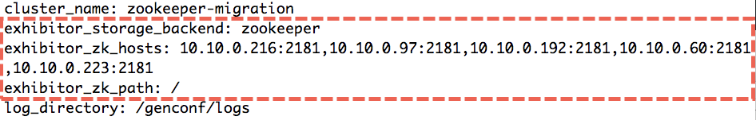
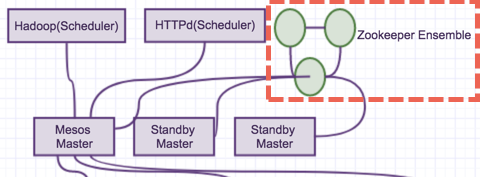
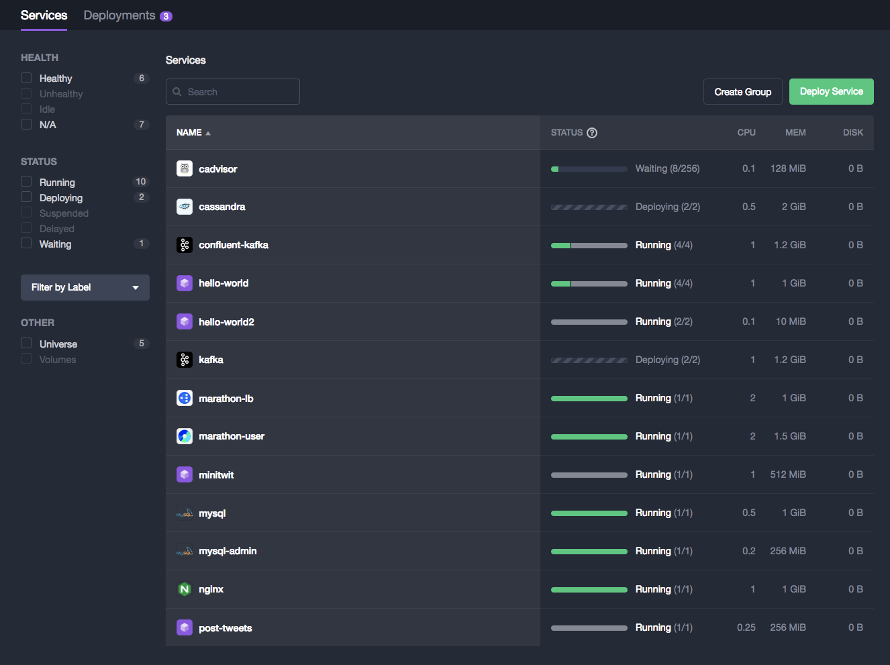
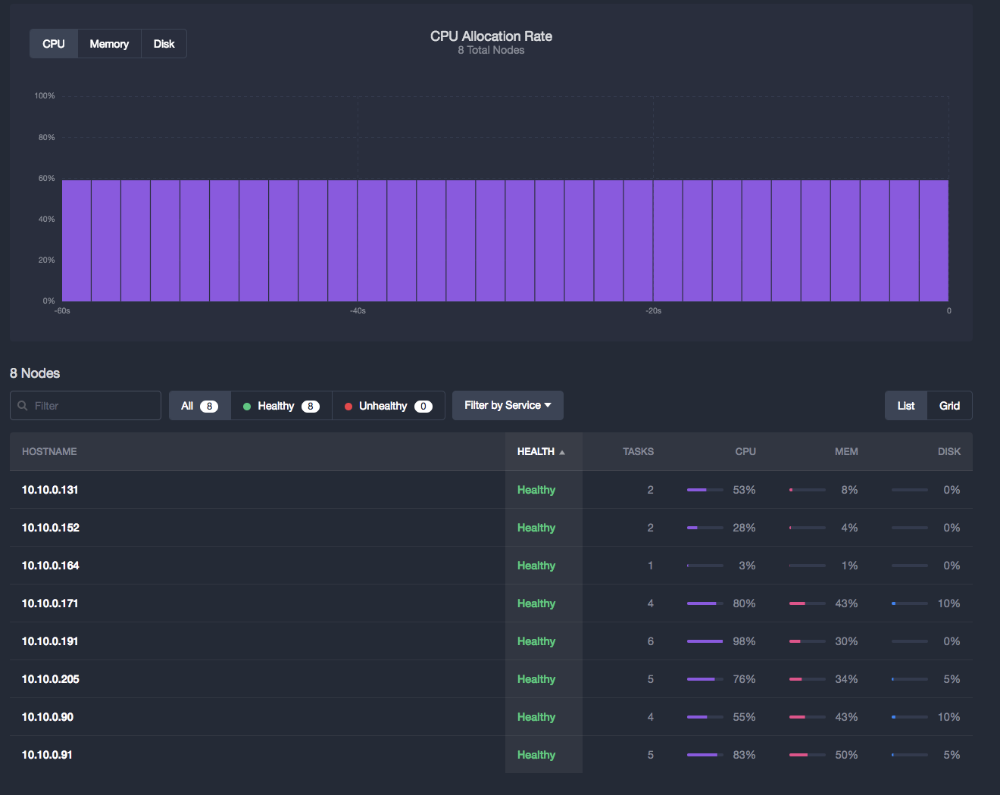
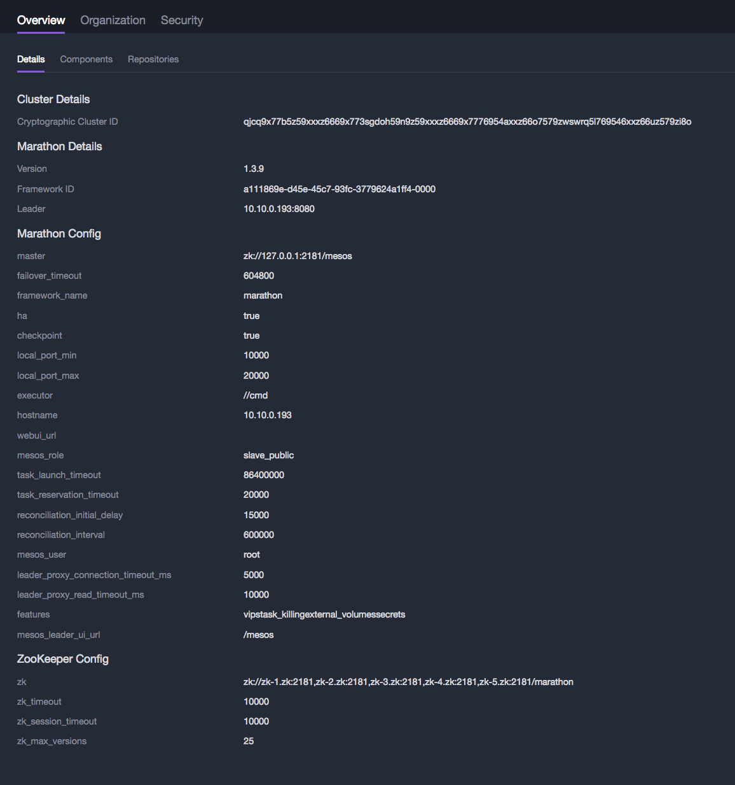
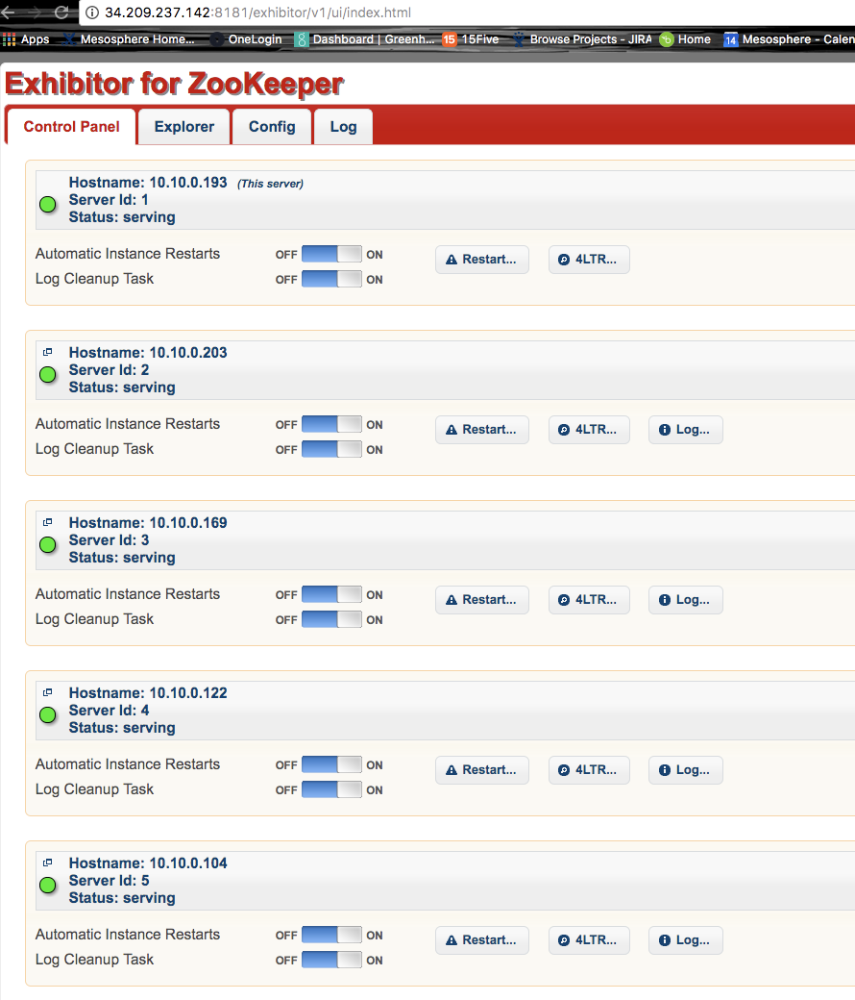

Exhibitor Backend Migration

How to change from ZK to Static Exhibitor Backend Non-disruptively  

*Mesosphere: JIRA DCOS-14915*

*September 28, 2017*

*[ajohnson@mesosphere.i*o](mailto:ajohnson@mesosphere.io)

[[TOC]]

## Overview 

The following procedure performs a manual rolling modification moving a DC/OS cluster from a Dynamic to Static ZooKeeper configuration. 

ZooKeeper storage backend is chosen during the initial cluster installation-- The Exhibitor Backend (EXHIBITOR_BACKEND) is defined in the DC/OS cluster configuration file, config.yaml. Changes to this file, or to the cluster at this level, are tantamount to a cluster-wide reconfiguration and/or re-installation. As such, changes of this nature must be carefully considered and planned for. 

In a dynamic configuration, the Exhibitor Backend (EXHIBITOR_BACKEND=ZK) is set to ZK. Following this environment parameter, the cluster is given a comma-separated list of IP address:port pairs (10.10.0.100:2181) to have Exhibitor connect to ZooKeeper. This environment parameter is the "ZK_CONFIG_CONNECT" environment variable. The last environment parameter used (typically) in a Dynamic configuration is the “ZK_CONFIG_ZPATH”. This is typically set to / (root) but sometimes might be configured differently on a per-cluster basis. Another caveat to the Dynamic configuration is that the ZK Ensemble used for the backend must be a separate Ensemble from the DC/OS cluster. 

In a Static Configuration, EXHIBITOR_BACKEND is given just one parameter: EXHIBITOR_BACKEND=STATIC. It is with this configuration parameter that Exhibitor uses local DC/OS storage for its backend. Additionally, with the STATIC backend, there is no longer a need for a separate ZooKeeper Ensemble. 

It is important to note that every ZooKeeper instance has an ‘ID’ that must be unique across all ZooKeepers in the cluster, at all times. With the ZooKeeper and S3 Exhibitor backends, it is unpredictable which ID will be assigned to which servers’s ZooKeeper instance; although, it will be somewhere between 1-number_of_masters. However, in some testing, it has been found that the numbers may be arbitrary if not operator assigned-- that is, you can find ‘IDs’ in a single ZooKeeper Ensemble ranging from 1-8 with 5 nodes in the Ensemble. In the case of the STATIC backend, the IDs match the digit preceding the ":" in the static server list: 

 

**#S****tarting State - these are the ZK nodes in a separate Ensemble:** 

cat /opt/mesosphere/etc/exhibitor

EXHIBITOR_BACKEND=ZK

ZK_CONFIG_CONNECT=10.10.0.249:2181,10.10.0.79:2181,10.10.0.125:2181

ZK_CONFIG_ZPATH=/

**#Ending State - the IP:ports listed in this configuration are DC/OS masters…:** 

cat /opt/mesosphere/etc/exhibitor
EXHIBITOR_BACKEND=STATIC
EXHIBITOR_STATICENSEMBLE="5:10.10.0.104,4:10.10.0.122,3:10.10.0.169,1:10.10.0.193,2:10.10.0.203"

## Starting State

It is worthwhile to first describe the cluster starting state so we can understand the motivation for the migration steps in the journey from Dynamic to Static configuration. 

### Cluster with Dynamic Exhibitor Backend set to "ZK" 

DC/OS Cluster configuration: "config.yaml" will have the following definition: 

Because the exhibitor_storage_backend is defined as "zookeeper", we must also have configured a separate standalone ZooKeeper ensemble to bundle with our DC/OS cluster: 

## Test Environment 

This procedure was tested with several separate environments. Listed here are three of the iterative test environments for the development of this procedure: 

1. DC/OS 1.8.8 with a ZK ensemble using internal storage. Cluster was running ~8 tasks and on 8 node cluster running CentOS 7.3.

2. DC/OS 1.8.8 with a ZK ensemble backed with S3 storage. Cluster was running ~8 tasks and on a 8 node cluster running CoreOS 1100.xx. 

3. (*Final*) DC/OS 1.8.8 with a ZK ensemble backed with local storage. Cluster was running ~30 tasks and on a 8 node cluster running CentOS 7.3. Node definition: 

    1. Bootstrap

    2. 3 ZooKeeper nodes in separate Ensemble. Running ZooKeeper 3.4.10

    3. 5 DC/OS Master nodes 

    4. 3 DC/OS Public agent nodes (Frontend) 

    5. 5 DC/OS Private agent nodes (Backend) 

## Terms and Definitions: 

<table>
  <tr>
    <td>exhibitor_storage_backend: static</td>
    <td>Using internal DC/OS storage for Exhibitor. This definition implies that the storage backend is managed internally within the cluster. </td>
  </tr>
  <tr>
    <td>exhibitor_storage_backend: zookeeper</td>
    <td>External storage for configuring and orchestrating zookeeper and Exhibitor on master nodes. Considered dynamic. </td>
  </tr>
  <tr>
    <td>exhibitor_zk_path</td>
    <td>Specifies the ZNode path that Exhibitor uses to store data in ZooKeeper. </td>
  </tr>
  <tr>
    <td>exhibitor_zk_hosts</td>
    <td>Comma separated list of host:port pairs used to configure the internal Exhibitor instances. </td>
  </tr>
  <tr>
    <td>exhibitor_static_ensemble</td>
    <td>Comma separated list of ZK-ID:host pairs used for the static ZK backend. In our case, these definitions are the DC/OS master servers. </td>
  </tr>
</table>

## Procedure for Migrating the ZK Backend

### Performing the Migration

The first step in switching to a static backend is determining what each local ZooKeeper (on DC/OS Master Servers) instance believes its current ID is. This can be accomplished by checking the output of the following ‘grep’ on each of the Masters-- The ID may have changed throughout the lifetime of the master, so you should use the last known/reported ID: 

#### Determining IDs on Masters

sudo journalctl -u dcos-exhibitor | grep -i "my id"

From here we build a list of the Master Servers and their known ID

<table>
  <tr>
    <td>Master # & command</td>
    <td>Output - ID</td>
  </tr>
  <tr>
    <td>Master 1: journalctl -u dcos-exhibitor |grep -i "my id"</td>
    <td>Oct 03 13:49:08 ip-10-10-0-193.us-west-2.compute.internal java[24740]: New election. My id =  1, proposed zxid=0x400000000</td>
  </tr>
  <tr>
    <td>Master 2: journalctl -u dcos-exhibitor |grep -i “my id”</td>
    <td>Oct 03 13:49:09 ip-10-10-0-122.us-west-2.compute.internal java[24286]: Connection broken for id 2, my id = 4, error =</td>
  </tr>
  <tr>
    <td>Master 3: journalctl -u dcos-exhibitor |grep -i “my id”</td>
    <td>Oct 03 13:49:09 ip-10-10-0-203.us-west-2.compute.internal java[24432]: Connection broken for id 5, my id = 2, error =</td>
  </tr>
  <tr>
    <td>Master 4: journalctl -u dcos-exhibitor |grep -i “my id”</td>
    <td>Oct 03 13:49:09 ip-10-10-0-104.us-west-2.compute.internal java[23835]: Connection broken for id 2, my id = 5, error =</td>
  </tr>
  <tr>
    <td>Master 5: journalctl -u dcos-exhibitor |grep -i “my id”</td>
    <td>Oct 03 13:49:09 ip-10-10-0-169.us-west-2.compute.internal java[24055]: Connection broken for id 2, my id = 3, error =</td>
  </tr>
</table>

#### Making the Configuration Change

Once the current ID for each dcos-exhibitor instance is determined, on the masters, you are ready to switch them to the static backend. Before attempting this migration of ZK Backend, copy the existing configuration: 

sudo cp /opt/mesosphere/etc/exhibitor /opt/mesosphere/etc/exhibitor.orig 

Edit /opt/mesosphere/etc/exhibitor and replace the existing EXHIBITOR_BACKEND= variable to "STATIC". And list the ZK (dcos-exhibitor) nodes in the EXHIBITOR_STATICENSEMBLE= variable. This needs to be changed on all masters. Additionally (see below), these IP addresses need to be ordered lexicographically. When you create the EXHIBITOR_STATICENSEMBLE variable, you will list the masters in order, with their ZK ID. 

#### Sorted list with IDs

<table>
  <tr>
    <td>Master IP Address</td>
    <td>My ID</td>
  </tr>
  <tr>
    <td>10.10.0.104</td>
    <td>5</td>
  </tr>
  <tr>
    <td>10.10.0.122</td>
    <td>4</td>
  </tr>
  <tr>
    <td>10.10.0.169</td>
    <td>3</td>
  </tr>
  <tr>
    <td>10.10.0.193</td>
    <td>1</td>
  </tr>
  <tr>
    <td>10.10.0.203</td>
    <td>2</td>
  </tr>
</table>

 

[centos@ip-10-10-0-193 ~]$ cat /opt/mesosphere/etc/exhibitor

EXHIBITOR_BACKEND=STATIC

EXHIBITOR_STATICENSEMBLE="5:10.10.0.104,4:10.10.0.122,3:10.10.0.169,1:10.10.0.193,2:10.10.0.203"

The IP addresses should be the internal addresses of the masters in the cluster and **they should be in lexicographical order (considered as a string not as a 4-byte IP address, with ‘.’ included**). The id's should match the actual id's you determined in the previous step. In general these will not be in the correct order. In the example above you can see that the first instance (the one whose IP address is ranked lowest lexicographically) has id 2 at the time when the configuration change begins. Change each /opt/mesosphere/etc/exhibitor file on each master before restarting. 

#### Restarting dcos-exhibitor to Apply the Modification

Restart exhibitor one at a time, waiting for the ZooKeeper ensemble to settle after each:

sudo systemctl restart dcos-exhibitor
sudo journalctl -u dcos-exhibitor -f
# wait until you see a line showing
# Oct 03 15:42:08 ip-10-10-0-193.us-west-2.compute.internal java[2847]: Closed socket connection for client /127.0.0.1:48022 (no session established for client)

Although at this time it might seem that it is not working, and risky to proceed, continue with the next master. Continue making the changes and monitoring per master, waiting until each settles, then proceed… 

By the time you have finished the 3rd master restart, you should start seeing messages such as: 

Master 1: 

Oct 03 15:46:40 ip-10-10-0-193.us-west-2.compute.internal java[2847]: Received connection request /10.10.0.203:49728

Oct 03 15:46:40 ip-10-10-0-193.us-west-2.compute.internal java[2847]: Notification: 1 (message format version), 2 (n.leader), 0x6000001a0 (n.zxid), 0x1 (n.round), LOOKING (n.state), 2 (n.sid), 0x6 (n.peerEpoch) **FOLLOWING (my state**)

Oct 03 15:46:40 ip-10-10-0-193.us-west-2.compute.internal java[2847]: Notification: 1 (message format version), 2 (n.leader), 0x6000001a0 (n.zxid), 0x6 (n.round), LOOKING (n.state), 2 (n.sid), 0x6 (n.peerEpoch) FOLLOWING (my state)

Once this rolling restart has completed and all instances are serving, you are running the static backend, although you're not done yet.

The issue is that when you modify (e.g. upgrade DC/OS) the cluster you'll configure the exhibitor_storage_backend=static (config.yaml) which will take the master_list and build the EXHIBITOR_STATICENSEMBLE string anew, but this includes a step where the master_list is sorted lexicographically prior to the id's being assigned. In short, after an upgrade you will find that /opt/mesosphere/etc/exhibitor contains the following:

EXHIBITOR_BACKEND=STATIC
EXHIBITOR_STATICENSEMBLE=5:10.10.0.104,4:10.10.0.122,3:10.10.0.169,2:10.10.0.193,1:10.10.0.203

Instead of:

EXHIBITOR_BACKEND=STATIC
EXHIBITOR_STATICENSEMBLE="5:10.10.0.104,4:10.10.0.122,3:10.10.0.169,1:10.10.0.193,2:10.10.0.203**"****
**

Continuing with the Completion of the Migration

This leads to an issue where the first master is modified, which causes it's zookeeper instance to think it has id=1, but one of the other masters who has yet to be upgraded believes that it has id=1, which leads to a conflict.

To fix this, we prepare for this eventually as the next step in the switch to the static backend.

This step is simple: simply open up /opt/mesosphere/etc/exhibitor again and fix the id's so the lowest lexicographical address gets id=1, the second gets id=2, etc. In other words, prepare the EXHIBITOR_STATICENSEMBLE environment variable to match what it would be changed to during an upgrade.

Once you've modified that file on all masters, you can restart the exhibitor processes again, one at a time.

Given that there are five servers and you've restarted exhibitor on the first, you will see lots of errors that look like:

Oct 03 17:22:57 ip-10-10-0-193.us-west-2.compute.internal java[15933]: WARN  [NIOServerCxn.Factory:0.0.0.0/0.0.0.0:2181:NIOServerCnxn@362] - Exception causing close of session 0x0 due to java.io.IOException: ZooKeeperServer not running

Oct 03 17:22:57 ip-10-10-0-193.us-west-2.compute.internal java[15933]: WARN  [NIOServerCxn.Factory:0.0.0.0/0.0.0.0:2181:NIOServerCnxn@362] - Exception causing close of session 0x0 due to java.io.IOException: ZooKeeperServer not running

This is due to zookeeper being in a state where it tries to join the existing ensemble but it is being refused due to some existing members of the ensemble claiming that its id is already in use.

At this point, you can restart exhibitor on the second master. This time, both the first and the second agree on which zookeeper processes should have which id assigned, so these two zookeepers form a quorum and proceed as normal. At this point, the third exhibitor will begin to issue **java.io.IOException: ZooKeeperServer not running** errors the same way the first was doing after it got restarted.

You can now restart the third exhibitor process and it will rejoin the cluster and after waiting some minutes while the rest of the dcos services bootstrap, the cluster will be healthy again, continue restarting the exhibitor process on the remaining master nodes.

During this procedure, it should be noted that connectivity to the DC/OS console will be lost at various stages because of the change occurring within the cluster configuration. 

*** Caution: In testing sometimes the zk ID is set with the original ID number and will persist through the modification without the need of changing the ID in /opt/mesosphere/etc/exhibitor a second time. If this file is changed again, the ensemble does go offline and will have to be put back into it’s original ID state/configuration. *

## Different Methods for Sorting the ZK Master List Lexicographically

We start with an existing zk_master_list (shown here, sorted): 

<table>
  <tr>
    <td>Master IP Address</td>
    <td>My ID</td>
  </tr>
  <tr>
    <td>10.10.0.104</td>
    <td>5</td>
  </tr>
  <tr>
    <td>10.10.0.122</td>
    <td>4</td>
  </tr>
  <tr>
    <td>10.10.0.169</td>
    <td>3</td>
  </tr>
  <tr>
    <td>10.10.0.193</td>
    <td>1</td>
  </tr>
  <tr>
    <td>10.10.0.203</td>
    <td>2</td>
  </tr>
</table>

### Methods for Sorting, in order of complexity 

*Python (line 394 calc.py):*

py // line 394

def calculate_exhibitor_static_ensemble(master_list):

    masters = json.loads(master_list)

    masters.sort()

    return ','.join(['%d:%s' % (i + 1, m) for i, m in enumerate(masters)])

*Simple sort, (relying on Operator prudence and verification): *

Provide a zk.list file

sort zk.list >zk.list.sorted

Or: cat zk.list |sort -r >zk.list2.sorted-r //to provide reverse sort

## Considerations for Setup, Testing, and Implementation

1. Verizon uses a dedicated ZK Ensemble for each DC/OS cluster. Commonly referred to "Platform ZooKeeper". This ZooKeeper Ensemble may be used for other purposes such as application communication, backups, transaction coordination, etc. 

2. What OS is Verizon’s ZK ensemble running on? Which version? 

3. What version of ZooKeeper does Verizon run in production? Test? 

4. Does Verizon use shared storage for ZK, which vendor/type (e.g. SAS; FC-SW; DAS; Flash (SSD))? 

5. Does Verizon have any unique configuration settings for ZK that we should mirror/emulate in test? 

6. Other considerations… such as performance, reliability, fault isolation, back-out procedures for reversing the migration? 

## Breadcrumbs & Conclusion: Configuration Data and Examples During the Migration

Much care should be taken prior to installing and configuring a cluster as to which kind of storage backing will be utilized by Exhibitor and Zookeeper. Although this procedure provides a mostly non-disruptive approach to Exhibitor backend migration, it cannot be assured that the environment and all tasks within the cluster will persist from starting to finished state of the migration. 

#### Starting state 

1 Bootstrap Server (local reference: provisioning server) 

3 ZooKeeper servers in a standalone Ensemble 

5 masters (local reference: mesos-masters) 

3 public agents (local reference: Frontend)

5 private agents (local reference: Backend) 

CentOS 7.3; host: m4.large 

DC/OS 1.8.8

ZooKeeper 3.4.10

##### Config.yaml: 

bootstrap_url: http://10.10.0.100

customer_key: 12345-12345-12345-12345-12345-123456

cluster_name: ZKMIGIV

exhibitor_storage_backend: zookeeper

exhibitor_zk_hosts: 10.10.0.249:2181,10.10.0.79:2181,10.10.0.125:2181

exhibitor_zk_path: /

log_directory: /genconf/logs

master_discovery: static

master_list:

- 10.10.0.193

- 10.10.0.122

- 10.10.0.203

- 10.10.0.104

- 10.10.0.169

resolvers:

- 169.254.169.253

- 8.8.8.8

security: disabled

mesos_dns_ip_sources:

- mesos

- docker

- host

telemetry_enabled: 'false'

process_timeout: 120

dcos_overlay_enable: 'false'

roles: slave_public

superuser_username: bootstrapuser

superuser_password_hash: $6$rounds=656000$qfmT6d8DjGGEjAjl$S7EUw/IrAML3h6cVPGrQd6sZ9uaagba7C0PgAAjcJPy5mFqV9kyJDSrEj97qpDrvJWHm5RaGfI3o8lXylRtt71

##### DC/OS GUI: 

*Our DC/OS Console showing tasks and current workloads*

*View of running services within the cluster*

*Nodes within our cluster- although contextually, there is no involvement on the procedure with agent nodes, as shown here workloads were running on a majority of the agents*

*DC/OS System Overview*

#### Exhibitor for ZooKeeper on DC/OS Masters

### Log output from first restart: 

[centos@ip-10-10-0-193 ~]$ sudo systemctl restart dcos-exhibitor; sudo journalctl -u dcos-exhibitor -f

-- Logs begin at Tue 2017-10-03 12:27:16 UTC. --

Oct 03 15:39:35 ip-10-10-0-193.us-west-2.compute.internal java[24740]: Closed socket connection for client /127.0.0.1:45794 (no session established for client)

Oct 03 15:39:37 ip-10-10-0-193.us-west-2.compute.internal systemd[1]: Stopping Exhibitor: Zookeeper Supervisor Service...

Oct 03 15:39:37 ip-10-10-0-193.us-west-2.compute.internal systemd[1]: dcos-exhibitor.service: main process exited, code=exited, status=143/n/a

Oct 03 15:39:37 ip-10-10-0-193.us-west-2.compute.internal systemd[1]: Unit dcos-exhibitor.service entered failed state.

Oct 03 15:39:37 ip-10-10-0-193.us-west-2.compute.internal systemd[1]: dcos-exhibitor.service failed.

Oct 03 15:39:37 ip-10-10-0-193.us-west-2.compute.internal systemd[1]: Started Exhibitor: Zookeeper Supervisor Service.

Oct 03 15:39:37 ip-10-10-0-193.us-west-2.compute.internal systemd[1]: Starting Exhibitor: Zookeeper Supervisor Service...

Oct 03 15:39:37 ip-10-10-0-193.us-west-2.compute.internal start_exhibitor.py[2701]: **Exhibitor configured for static ZK ensemble**

Oct 03 15:39:37 ip-10-10-0-193.us-west-2.compute.internal **start_exhibitor.py[2701]: Running exhibitor as command: ['java', '-Djava.util.prefs.systemRoot=/var/lib/dcos/exhibitor/', '-Djava.util.prefs.userRoot=/var/lib/dcos/exhibitor/', '-Duser.home=/var/lib/dcos/exhibitor/', '-Duser.dir=/var/lib/dcos/exhibitor/', '-jar', '/opt/mesosphere/packages/exhibitor--dbd1a61e0f16f9e71131ab347f35102035275672/usr/exhibitor/exhibitor.jar', '--port', '8181', '--defaultconfig', '/run/dcos_exhibitor/exhibitor_defaults.conf', '--hostname', '10.10.0.193', '--configtype=static', ****_'--staticensemble'_****,** **_'5:10.10.0.104,4:10.10.0.122,3:10.10.0.169,1:10.10.0.193,2:10.10.0.203']_**

**_Oct 03 15:39:37 ip-10-10-0-193.us-west-2.compute.internal _**

---SNIP---

Oct 03 15:40:09 ip-10-10-0-193.us-west-2.compute.internal java[2847]: Notification: 1 (message format version), 4 (n.leader), 0x400000000 (n.zxid), 0x5 (n.round), **LOOKING** (n.state), 2 (n.sid), 0x4 (n.peerEpoch) LOOKING (my state)

Oct 03 15:40:09 ip-10-10-0-193.us-west-2.compute.internal java[2847]: Notification: 1 (message format version), 4 (n.leader), 0x400000000 (n.zxid), 0x5 (n.round), **FOLLOWING** (n.state), 2 (n.sid), 0x5 (n.peerEpoch) LOOKING (my state)

Oct 03 15:40:09 ip-10-10-0-193.us-west-2.compute.internal java[2847]: Notification: 1 (message format version), 4 (n.leader), 0x400000000 (n.zxid), 0x5 (n.round), **LOOKING** (n.state), 3 (n.sid), 0x4 (n.peerEpoch) LOOKING (my state)

Oct 03 15:40:09 ip-10-10-0-193.us-west-2.compute.internal java[2847]: Notification: 1 (message format version), 4 (n.leader), 0x400000000 (n.zxid), 0x5 (n.round), **FOLLOWING** (n.state), 3 (n.sid), 0x5 (n.peerEpoch) LOOKING (my state)

Oct 03 15:40:09 ip-10-10-0-193.us-west-2.compute.internal java[2847]: Notification: 1 (message format version), 1 (n.leader), 0x5000018b6 (n.zxid), 0x5 (n.round), **LOOKING** (n.state), 1 (n.sid), 0x5 (n.peerEpoch) LOOKING (my state)

Oct 03 15:40:09 ip-10-10-0-193.us-west-2.compute.internal java[2847]: Received connection request /10.10.0.104:32876

Oct 03 15:40:09 ip-10-10-0-193.us-west-2.compute.internal java[2847]: Notification: 1 (message format version), 4 (n.leader), 0x400000000 (n.zxid), 0x5 (n.round), **LOOKING** (n.state), 4 (n.sid), 0x4 (n.peerEpoch) LOOKING (my state)

Oct 03 15:40:09 ip-10-10-0-193.us-west-2.compute.internal java[2847]: Notification: 1 (message format version), 4 (n.leader), 0x400000000 (n.zxid), 0x5 (n.round), **LEADING** (n.state), 4 (n.sid), 0x5 (n.peerEpoch) LOOKING (my state)

Ending Config.yaml: 

bootstrap_url: http://10.10.0.100

customer_key: 12345-12345-12345-12345-12345-123456

cluster_name: ZKMIGIV

exhibitor_storage_backend: static

log_directory: /genconf/logs

master_discovery: static

master_list:

- 10.10.0.193

- 10.10.0.122

- 10.10.0.203

- 10.10.0.104

- 10.10.0.169

resolvers:

- 169.254.169.253

- 8.8.8.8

security: disabled

mesos_dns_ip_sources:

- mesos

- docker

- host

telemetry_enabled: 'false'

process_timeout: 120

dcos_overlay_enable: 'false'

roles: slave_public

superuser_username: bootstrapuser

superuser_password_hash: $6$rounds=656000$qfmT6d8DjGGEjAjl$S7EUw/IrAML3h6cVPGrQd6sZ9uaagba7C0PgAAjcJPy5mFqV9kyJDSrEj97qpDrvJWHm5RaGfI3o8lXylRtt71

