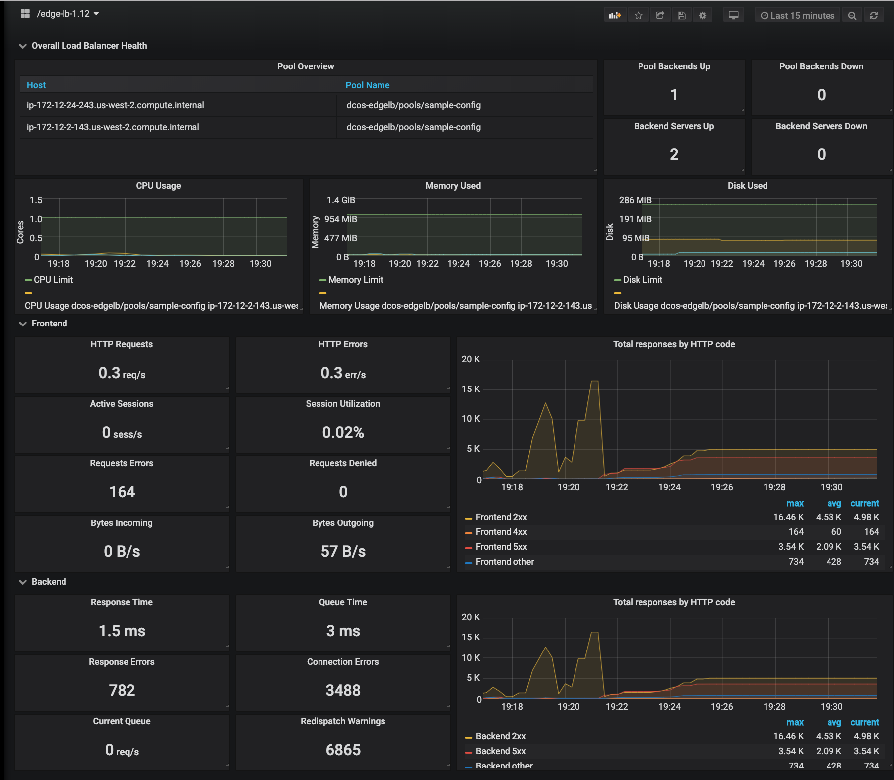

# Grafana Dashboards for DC/OS

The dashboards config files and setup instructions are provided here:

* [DC/OS 1.12](dcos-1.12/)
* [DC/OS 1.11](dcos-1.11/)

## Table of Contents

* [Graph samples](#graph-samples)
* [Primary Metrics to Monitor](#primary-metrics-to-monitor)
  * [Mesos Metrics](#mesos-metrics)
  * [Marathon Metrics](#marathon-metrics)
  * [Container Metrics](#container-metrics)
* [Edge-LB Metrics](#edge-lb-metrics)

## Graph samples

Here are some sample graphs.

## Primary Metrics to Monitor

Metrics are primarily segregated into 4 categories

* DC/OS Metrics
* Mesos metrics
* Marathon metrics
* Node metrics

Source: [DC/OS Documentation][mesosphere-performance]

What follows is an outline for the starting point of what the metrics are that typically the common ones to monitor. There are many more metrics worthy of inclusion. Thresholds should be determined when the use case and capacity of the cluster are better understood. High resource usage for sustained periods of time may indicate that you need to add capacity to your cluster or that a framework is misbehaving.

### Mesos Metrics

Source: [Apache Mesos Documentation][mesos-monitoring]

#### Resources

The following metrics provide information about the total resources available in the cluster and their current usage. High resource usage for sustained periods of time may indicate that you need to add capacity to your cluster or that a framework is misbehaving.

| Metric | Description | Shown as | Alert |
|---|---|---|---|
| master/cpus_percent | Percentage of allocated CPUs | Gauge | 75% |
| master/mem_percent | Percentage of allocated memory | Gauge | 75% |

#### Masters

The following metrics provide information about whether a master is currently elected and how long it has been running. A cluster with no elected master for sustained periods of time indicates a malfunctioning cluster.

| Metric | Description | Shown as | Alert |
|---|---|---|---|
| master/uptime_secs | Uptime in seconds. The master has restarted and the cluster has a flapping master node if this is constantly low. | Gauge | Monitor for < 300 |
| master/elected | Whether this is the elected master | Gauge | Monitor for change 0 > 1 or 1 > 0 |

#### System

The following metrics provide information about the system level on this Master node. High resource usage in a master node for sustained periods of time may degrade the performance of the cluster.

| Metric | Description | Shown as | Alert |
|---|---|---|---|
| system/load_15min | Load average for the past 15 minutes | Gauge | 75 % |
| system/load_5min | Load average for the past 5 minutes | Gauge | 75 % |
| system/load_1min | Load average for the past minute | Gauge | 75 % |
| system/mem_free_bytes | Free memory in bytes | Gauge | combine into percentage - 75% |
| system/mem_total_bytes | Total memory in bytes | Gauge | combine into percentage - 75% |

#### Agents

The following metrics provide information about agent events, agent counts, and agent states. A low number of active agents may indicate that agents are unhealthy or that they are not able to connect to the elected master.

| Metric | Description | Shown as | Alert |
|---|---|---|---|
| master/slaves_active | Number of active agents. If low Agents are having trouble connecting to the master. | Counter | Any change |

#### Frameworks

The following metrics provide information about the registered frameworks in the cluster. No active or connected frameworks may indicate that a scheduler is not registered or that it is misbehaving.

| Metric | Description | Shown as | Alert |
|---|---|---|---|
|  master/frameworks_active | Number of active frameworks | Gauge | Any change |

#### Tasks

A high rate of lost tasks may indicate that there is a problem with the cluster.

| Metric | Description | Shown as | Alert |
|---|---|---|---|
| master/tasks_error | Number of tasks that were invalid | Counter | Any increase |
| master/tasks_failed | Number of failed tasks | Counter | Any increase |
| master/tasks_lost | Number of lost tasks. Tasks in the cluster are disappearing. Possible causes include hardware failures, bugs in one of the frameworks, or bugs in Mesos. | Counter | Any change |
| master/tasks_unreachable | Number of unreachable tasks | Counter | Any change |

#### Replicated log

The following metrics provide information about the replicated log underneath the registrar, which is the persistent store for masters.

| Metric | Description | Shown as | Alert |
|---|---|---|---|
|  registrar/log/recovered | Whether the replicated log for the registrar has caught up with the other masters in the cluster. A cluster is operational as long as a quorum of "recovered" masters is available in the cluster. | Counter | alert if not equal |
| registrar/log/ensemble_size | The number of masters in the ensemble (cluster) that the current master communicates with (including itself) to form the replicated log quorum. It's imperative that this number is always less than `--quorum * 2` to prevent split-brain. It's also important that it should be greater than or equal to `--quorum` to maintain availability. | Counter | alert if not equal |

### Marathon Metrics

Source: [Marathon Documentation][marathon-monitoring]

| Metric | Description | Shown as | Alert |
|---|---|---|---|
| service.mesosphere.marathon.leaderDuration | Duration the current Marathon has been in leadership | Gauge | < 300 |
| service.mesosphere.marathon.uptime | Provides uptime of the Marathon | Gauge | < 300 |
| service.mesosphere.marathon.task.running.count | Number of running tasks on Marathon | Counter | Dashboard |
| service.mesosphere.marathon.task.staged.count | Number of tasks staging on the Marathon instances- should be monitored for blocked staging tasks | Counter | Dashboard |
| service.mesosphere.marathon.app.count | Number of apps running on that instance of Marathon. Shown as a value and should be regularly monitored. | Counter | Dashboard |
| service.mesosphere.marathon.group.count | Number of groups configured on the Marathon | Counter | Dashboard |
| jvm.threads.count | The total number of threads. This number should be below 500. | Counter | alert > 500 |
| jvm.memory.total.used | The total number of bytes used by the Marathon JVM. | Counter | identify default, alert > 80% of default |

### Container Metrics

Metrics for a container on an agent are available at the following endpoint: `http(s)://<master_IP>/system/v1/agent/<agent_id>/metrics/v0/node/container/<container_id>`

Response is returned as a JSON document and the returned Metrics include the following measurements: CPU, Memory, Disk, Network, Metadata

Source: [Container Metrics][mesosphere-container]

## Edge-LB Metrics

Source: [Datadog: HAProxy Performance][datadog-haproxy]

### Health Monitoring

Edge-LB provides (external to internal) load-balancing and is based on HAProxy. You would monitor Edge-LB the same way you would monitor the HTTP protocols it is load balancing. For example, you would have your monitoring application make HTTP request against the load balancer and the HTTP backends. If you get a negative result, that means the load balancer either stopped working or all the backends are not responding.

### Pool Utilization

Since the Edge-LB Pool servers are started as a Mesos task, you can use the DC/OS Prometheus endpoint to retrieve the following measurements: CPU, Memory, Disk, Network, Metadata the same as with any other task started on DC/OS. The following metrics should be watched for the utilization og the HAProxy Mesos Task:

**Overall load balancer utilization:** load balancer CPU and memory usage.

| Metric | Description | Type | Alert |
|---|---|---|---|
| cpus_user_time_secs | Total CPU time spent. | Utilization | 75 % |
| mem_total_bytes | Total memory of a process in RAM. | Utilization | 75 % |

### HAProxy Metrics

You can attach directly to the HAProxy instance started by the Edge-LB service. HAProxy has mainly two components:

* _Frontend:_ This refers to the endpoint for serving client requests.
* _Backend:_ This refers to the actual service endpoints for whom Edge-LB is doing balancing.

Monitoring the load balancer means monitoring these frontend, backend metrics and overall load balancer health metrics.

**Overall load balancer health metrics:** Number of healthy backends for each frontend and number of healthy servers for each backend.

| Metric | Description | Type | Alert |
|---|---|---|---|
| backend_up | Current health status of the backend (UP or DOWN). | Availability | Any Decrease |
| server_up | Current health status of the backend server (UP or DOWN). | Availability | Any Decrease |

**Frontend metrics:** This includes metrics like client requests per second, client response codes, bytes sent/received by/from clients.

| Metric | Description | Type | Alert |
|---|---|---|---|
| req_rate | HTTP requests per second | Throughput | Dashboard |
| rate | Number of sessions created per second. Note: Define session limit based on historical trends to avoid denial of service. | Throughput | Dashboard |
| session utilization (computed) | Percentage of sessions used (scur / slim * 100) | Utilization | 75 % |
| ereq | Number of request errors | Error | Significant Increase | |
| dreq | Requests denied due to security concerns (ACL-restricted) | Error | Significant Increase |
| hrsp_4xx | Number of HTTP client errors | Error | Dashboard |
| hrsp_5xx | Number of HTTP server errors | Error | Dashboard |
| bin | Number of bytes received by the frontend. Note: Monitor in order to decide if you need to scale your network infrastructure | Utilization | Dashboard |
| bout | Number of bytes sent by the frontend. Note: Monitor in order to decide if you need to scale your network infrastructure | Utilization | Dashboard |

**Backend metrics:** This includes metrics like average backend response time, average time spent by a request in a queue before being served by the backend, queue length.

| Metric | Description | Type | Alert |
|---|---|---|---|
| rtime | Average backend response time (in ms) for the last 1,024 requests | Throughput | > 250 ms |
| econ | Number of requests that encountered an error attempting to connect to a backend | server | Error | Dashboard |
| eresp | Number of requests whose responses yielded an error | Error | Dashboard |
| qcur | Current number of requests unassigned in queue | Saturation | Significant Increase |
| qtime | Average time spent in queue (in ms) for the last 1,024 requests | Saturation | > 250 ms |
| wredis | Number of times a request was redispatched to a different backend | Availability | Dashboard |

[mesosphere-performance]: https://docs.mesosphere.com/1.11/monitoring/performance-monitoring/
[mesosphere-container]: https://docs.mesosphere.com/1.11/metrics/reference/#container
[mesos-monitoring]: http://mesos.apache.org/documentation/latest/monitoring/
[marathon-monitoring]: https://mesosphere.github.io/marathon/docs/metrics.html
[datadog-haproxy]: https://www.datadoghq.com/blog/monitoring-haproxy-performance-metrics/