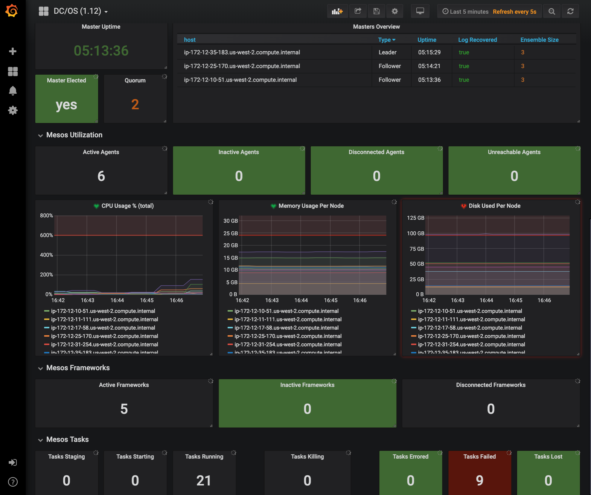
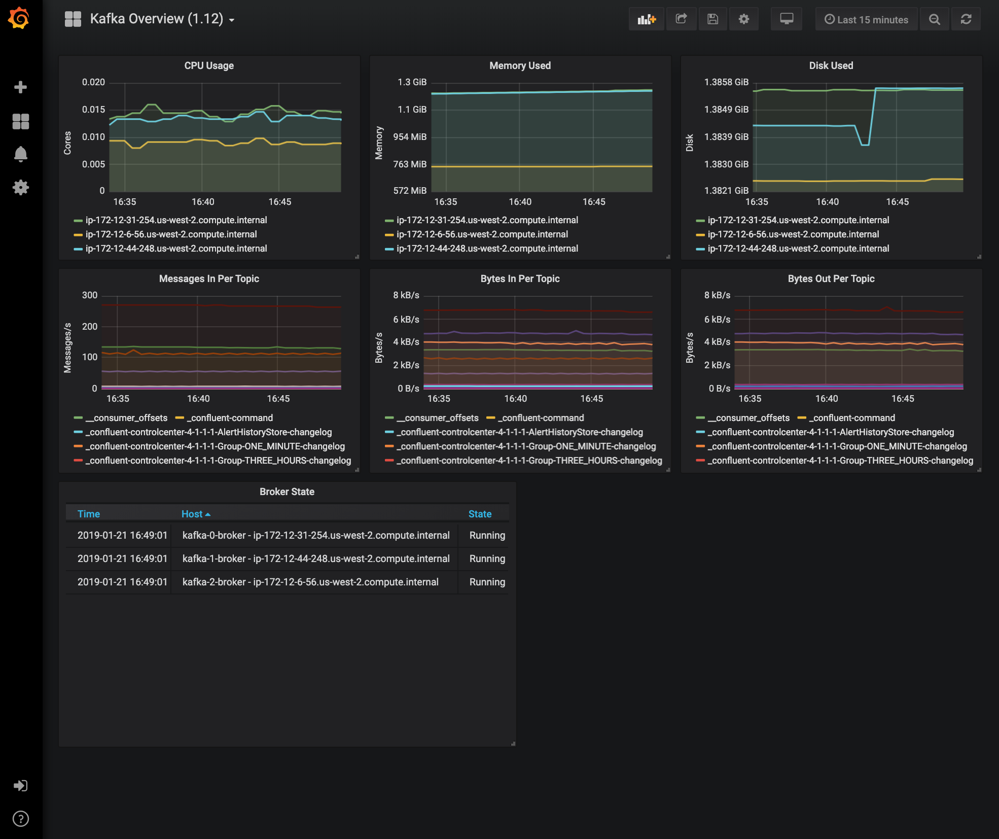
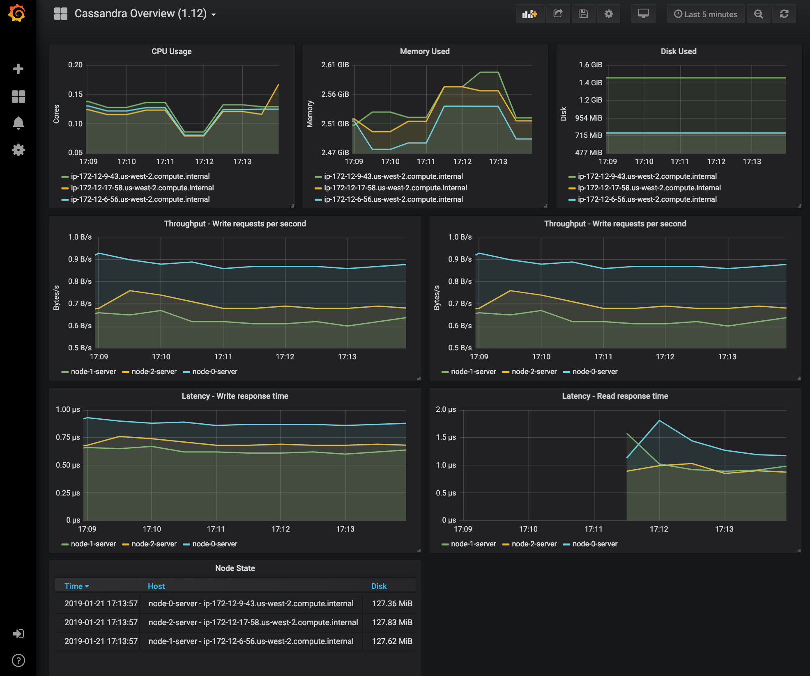

# Grafana Dashboards for DC/OS

The dashboards config files and setup instructions are provided here:

* [DC/OS 1.12](dcos-1.12/)
* [DC/OS 1.11](dcos-1.11/)

## Graph samples

Here are some sample graphs.

## Primary Metrics to Monitor

Metrics are primarily segregated into 4 categories

* DC/OS Metrics
* Mesos metrics
* Marathon metrics
* Node metrics

Source: [DC/OS Documentation][mesosphere-performance]

What follows is an outline for the starting point of what the metrics are that typically the common ones to monitor. There are many more metrics worthy of inclusion. Thresholds should be determined when the use case and capacity of the cluster are better understood. High resource usage for sustained periods of time may indicate that you need to add capacity to your cluster or that a framework is misbehaving.

### Mesos Metrics

Source: [Apache Mesos Documentation][mesos-monitoring]

#### Resources

The following metrics provide information about the total resources available in the cluster and their current usage. High resource usage for sustained periods of time may indicate that you need to add capacity to your cluster or that a framework is misbehaving.

| Metric | Description | Shown as | Alert |
|---|---|---|---|
| master/cpus_percent | Percentage of allocated CPUs | Gauge | 75% |
| master/mem_percent | Percentage of allocated memory | Gauge | 75% |

#### Masters

The following metrics provide information about whether a master is currently elected and how long it has been running. A cluster with no elected master for sustained periods of time indicates a malfunctioning cluster.

| Metric | Description | Shown as | Alert |
|---|---|---|---|
| master/uptime_secs | Uptime in seconds. The master has restarted and the cluster has a flapping master node if this is constantly low. | Gauge | Monitor for < 300 |
| master/elected | Whether this is the elected master | Gauge | Monitor for change 0 > 1 or 1 > 0 |

#### System

The following metrics provide information about the system level on this Master node. High resource usage in a master node for sustained periods of time may degrade the performance of the cluster.

| Metric | Description | Shown as | Alert |
|---|---|---|---|
| system/load_15min | Load average for the past 15 minutes | Gauge | 75 % |
| system/load_5min | Load average for the past 5 minutes | Gauge | 75 % |
| system/load_1min | Load average for the past minute | Gauge | 75 % |
| system/mem_free_bytes | Free memory in bytes | Gauge | combine into percentage - 75% |
| system/mem_total_bytes | Total memory in bytes | Gauge | combine into percentage - 75% |

#### Agents

The following metrics provide information about agent events, agent counts, and agent states. A low number of active agents may indicate that agents are unhealthy or that they are not able to connect to the elected master.

| Metric | Description | Shown as | Alert |
|---|---|---|---|
| master/slaves_active | Number of active agents. If low Agents are having trouble connecting to the master. | Counter | Any change |

#### Frameworks

The following metrics provide information about the registered frameworks in the cluster. No active or connected frameworks may indicate that a scheduler is not registered or that it is misbehaving.

| Metric | Description | Shown as | Alert |
|---|---|---|---|
|  master/frameworks_active | Number of active frameworks | Gauge | Any change |

#### Tasks

A high rate of lost tasks may indicate that there is a problem with the cluster.

| Metric | Description | Shown as | Alert |
|---|---|---|---|
| master/tasks_error | Number of tasks that were invalid | Counter | Any increase |
| master/tasks_failed | Number of failed tasks | Counter | Any increase |
| master/tasks_lost | Number of lost tasks. Tasks in the cluster are disappearing. Possible causes include hardware failures, bugs in one of the frameworks, or bugs in Mesos. | Counter | Any change |
| master/tasks_unreachable | Number of unreachable tasks | Counter | Any change |

#### Replicated log

The following metrics provide information about the replicated log underneath the registrar, which is the persistent store for masters.

| Metric | Description | Shown as | Alert |
|---|---|---|---|
|  registrar/log/recovered | Whether the replicated log for the registrar has caught up with the other masters in the cluster. A cluster is operational as long as a quorum of "recovered" masters is available in the cluster. | Counter | alert if not equal |
| registrar/log/ensemble_size | The number of masters in the ensemble (cluster) that the current master communicates with (including itself) to form the replicated log quorum. It's imperative that this number is always less than `--quorum * 2` to prevent split-brain. It's also important that it should be greater than or equal to `--quorum` to maintain availability. | Counter | alert if not equal |

### Marathon Metrics

Source: [Marathon Documentation][marathon-monitoring]

| Metric | Description | Shown as | Alert |
|---|---|---|---|
| service.mesosphere.marathon.leaderDuration | Duration the current Marathon has been in leadership | Gauge | < 300 |
| service.mesosphere.marathon.uptime | Provides uptime of the Marathon | Gauge | < 300 |
| service.mesosphere.marathon.task.running.count | Number of running tasks on Marathon | Counter | Dashboard |
| service.mesosphere.marathon.task.staged.count | Number of tasks staging on the Marathon instances- should be monitored for blocked staging tasks | Counter | Dashboard |
| service.mesosphere.marathon.app.count | Number of apps running on that instance of Marathon. Shown as a value and should be regularly monitored. | Counter | Dashboard |
| service.mesosphere.marathon.group.count | Number of groups configured on the Marathon | Counter | Dashboard |
| jvm.threads.count | The total number of threads. This number should be below 500. | Counter | alert > 500 |
| jvm.memory.total.used | The total number of bytes used by the Marathon JVM. | Counter | identify default, alert > 80% of default |

### Container Metrics

Metrics for a container on an agent are available at the following endpoint: `http(s)://<master_IP>/system/v1/agent/<agent_id>/metrics/v0/node/container/<container_id>`

Response is returned as a JSON document and the returned Metrics include the following measurements: CPU, Memory, Disk, Network, Metadata

Source: [Container Metrics][mesosphere-container]

[mesosphere-performance]: https://docs.mesosphere.com/1.11/monitoring/performance-monitoring/
[mesosphere-container]: https://docs.mesosphere.com/1.11/metrics/reference/#container
[mesos-monitoring]: http://mesos.apache.org/documentation/latest/monitoring/
[marathon-monitoring]: https://mesosphere.github.io/marathon/docs/metrics.html