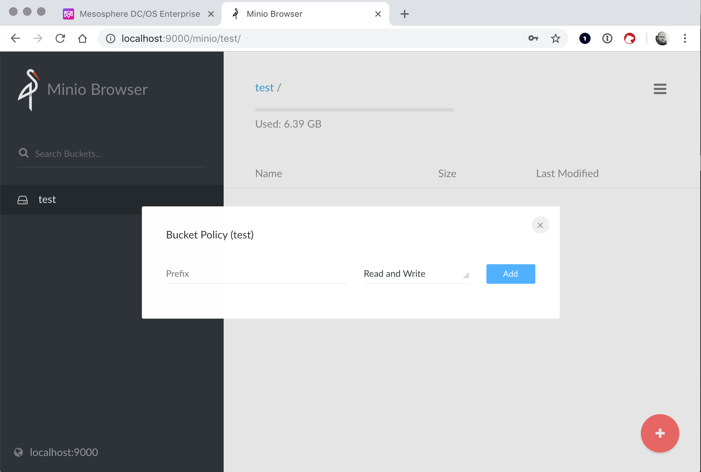

# Kubernetes - Backup and Recovery with Minio

The official guide for backup/recovery of Kubernetes on DC/OS only works with AWS_S3. So you cannot use it if you deploy MKE on-premise or a different cloud provider than AWS.

Ref.:

- [Disaster Recovery - Mesosphere DC/OS Documentation](https://docs.mesosphere.com/services/kubernetes/latest/operations/disaster-recovery/)

This tutorial expects a Kubernetes-Cluster (as part of MKE) is already deployed and fully functional.

## Install Minio

```bash
dcos package install minio
```

The default credentials are:

- access key: `minio`
- secret key: `minio123`

For easy access do SSH port forwarding to access the Minio UI from your local machine:

```bash
dcos node ssh --master-proxy --leader --user centos --option LocalForward=9000=minio.marathon.l4lb.thisdcos.directory:9000
```

On your local machine point your browser to [http://localhost:9000](http://localhost:9000/), login to Minio and create a bucket called “test” that has read/write permissions:



## Configure/Install Velero

Install velero cli (e.g. on Mac):

```bash
brew install velero 
```

Install the prerequisites for Velero on your Kubernetes cluster:

```bash
kubectl apply -f https://raw.githubusercontent.com/heptio/velero/v0.11.0/examples/common/00-prereqs.yaml
```

Apply the following config for Velero to use the Minio backend:

```yaml
kubectl apply -f - <<EOF
---
apiVersion: velero.io/v1
kind: BackupStorageLocation
metadata:
  name: default
  namespace: velero
spec:
  provider: aws
  objectStorage:
    bucket: test
  config:
    region: minio
    s3ForcePathStyle: "true"
    s3Url: http://minio.marathon.l4lb.thisdcos.directory:9000
---
apiVersion: v1
kind: Secret
metadata:
  namespace: velero
  name: cloud-credentials
  labels:
    component: minio
stringData:
  cloud: |
    [default]
    aws_access_key_id = minio
    aws_secret_access_key = minio123
EOF
```

Deploy Velero:

```yaml
kubectl apply -f - <<EOF
---
apiVersion: apps/v1beta1
kind: Deployment
metadata:
  namespace: velero
  name: velero
spec:
  replicas: 1
  template:
    metadata:
      labels:
        component: velero
      annotations:
        prometheus.io/scrape: "true"
        prometheus.io/port: "8085"
        prometheus.io/path: "/metrics"
    spec:
      restartPolicy: Always
      serviceAccountName: velero
      containers:
        - name: velero
          image: gcr.io/heptio-images/velero:latest
          command:
            - /velero
          args:
            - server
          volumeMounts:
            - name: cloud-credentials
              mountPath: /credentials
            - name: plugins
              mountPath: /plugins
            - name: scratch
              mountPath: /scratch
          env:
            - name: AWS_SHARED_CREDENTIALS_FILE
              value: /credentials/cloud
            - name: VELERO_SCRATCH_DIR
              value: /scratch
      volumes:
        - name: cloud-credentials
          secret:
            secretName: cloud-credentials
        - name: plugins
          emptyDir: {}
        - name: scratch
          emptyDir: {}
EOF
```

Check if Velero initialized and is using Minio as a backend:

```yaml
$ kubectl get BackupStorageLocation -n velero default -o yaml
apiVersion: velero.io/v1
kind: BackupStorageLocation
metadata:
  annotations:
    kubectl.kubernetes.io/last-applied-configuration: |
      {"apiVersion":"velero.io/v1","kind":"BackupStorageLocation","metadata":{"annotations":{},"name":"default","namespace":"velero"},"spec":{"config":{"region":"minio","s3ForcePathStyle":"true","s3Url":"http://minio.marathon.l4lb.thisdcos.directory:9000"},"objectStorage":{"bucket":"test"},"provider":"aws"}}
  creationTimestamp: "2019-03-28T05:31:25Z"
  generation: 2
  name: default
  namespace: velero
  resourceVersion: "2588"
  selfLink: /apis/velero.io/v1/namespaces/velero/backupstoragelocations/default
  uid: bae00299-511a-11e9-a88a-fed4c63d1e32
spec:
  config:
    region: minio
    s3ForcePathStyle: "true"
    s3Url: http://minio.marathon.l4lb.thisdcos.directory:9000
  objectStorage:
    bucket: test
  provider: aws
status:
  lastSyncedRevision: ""
  lastSyncedTime: "2019-03-28T05:34:46.171183989Z"
```

## Test Backup/Restore of a Namespace

Apply the [Nginx Example](https://raw.githubusercontent.com/heptio/velero/master/examples/nginx-app/base.yaml)  from the Velero docs:

```yaml
kubectl apply -f - <<EOF
---
apiVersion: v1
kind: Namespace
metadata:
  name: nginx-example
  labels:
    app: nginx
---
apiVersion: apps/v1beta1
kind: Deployment
metadata:
  name: nginx-deployment
  namespace: nginx-example
spec:
  replicas: 2
  template:
    metadata:
      labels:
        app: nginx
    spec:
      containers:
      - image: nginx:1.7.9
        name: nginx
        ports:
        - containerPort: 80
---
apiVersion: v1
kind: Service
metadata:
  labels:
    app: nginx
  name: my-nginx
  namespace: nginx-example
spec:
  ports:
  - port: 80
    targetPort: 80
  selector:
    app: nginx
  type: LoadBalancer
EOF
```

Check if the Nginx service and pods have started:

```bash
$ kubectl get all -n nginx-example
NAME                                    READY   STATUS    RESTARTS   AGE
pod/nginx-deployment-5c689d88bb-5ltbv   1/1     Running   0          13s
pod/nginx-deployment-5c689d88bb-nvwf6   1/1     Running   0          13s

NAME               TYPE           CLUSTER-IP     EXTERNAL-IP   PORT(S)        AGE
service/my-nginx   LoadBalancer   10.100.89.51   <pending>     80:32311/TCP   14s

NAME                               DESIRED   CURRENT   UP-TO-DATE   AVAILABLE   AGE
deployment.apps/nginx-deployment   2         2         2            2           14s

NAME                                          DESIRED   CURRENT   READY   AGE
replicaset.apps/nginx-deployment-5c689d88bb   2         2         2       14s
```

Create a backup:

```bash
velero backup create nginx-backup --include-namespaces nginx-example
```

Check if the backup was successful:

```bash
velero backup describe nginx-backup
```

Delete the namespace:

```bash
kubectl delete namespaces nginx-example
```

When the deletion completed, perform a restore of the namespace:

```bash
velero restore create --from-backup nginx-backup
```

Check that namespace and it’s pods and services got successfully restored:

```bash
kubectl get all -n nginx-example
```